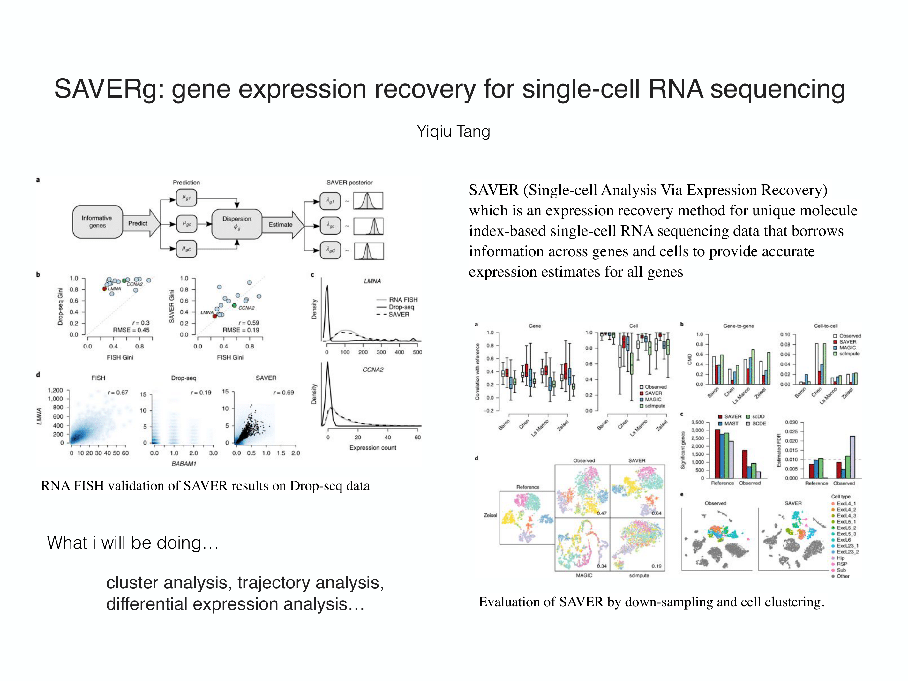
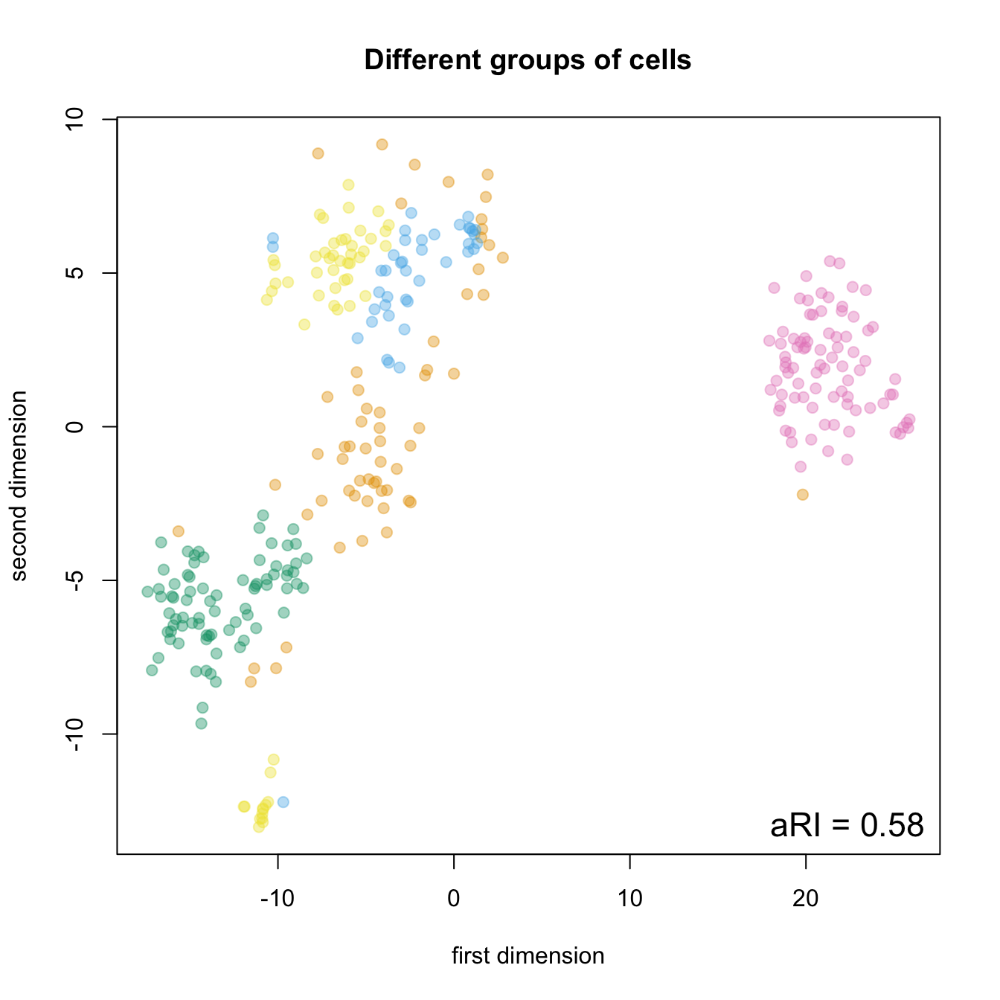
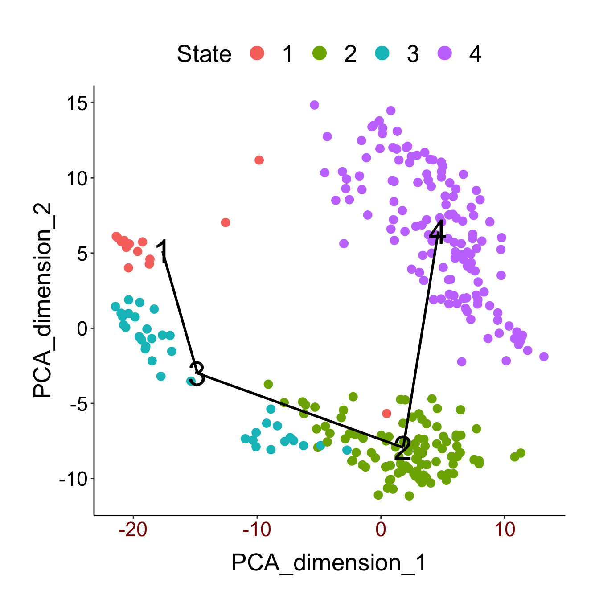

# SAVERg

SAVERg is designed to carry out two experiments (e.g. cell clustering and pseudotime trajectory analysis) 
to assess the imputation accuracy of SAVER.SAVER (Single-cell Analysis Via Expression Recovery) which is an 
expression recovery method for unique molecule index-based single-cell RNA sequencing data that borrows 
information across genes and cells to provide accurate expression estimates for all genes.


##Installation

The package is archived in Github. The following code can be used to install the package.

```R
require("devtools")
install_github("yiqiutang/SAVERg", build vignettes = TRUE))
library(SAVERg)
```


##Overview

An overview of SAVERg is described below:



for more details...

```R
browseVignettes(SAVERg)
```
...for an overview that briefly descrbes the main compoments of the package.


##Examples

####Cell clustering

We take the iPSC dataset as an example. The rows correspond to genes and the columns correspond to cells. 
The cell labels are known and can be treated as the gold standard.

```R
library(SAVERg)
cell_clustering(ipsc_saver)
```



####Pseudotime trajectory analysis

We take the deng dataset as an example. The rows correspond to genes and the columns correspond to cells. 
The cell labels are known and can be treated as the gold standard.

```R
deng_cellLabels <- factor(colnames(deng_count_data),
                          levels=c('zygote', 'early 2-cell', 'mid 2-cell', 'late 2-cell',
                                   '4-cell', '8-cell', '16-cell', 'early blastocyst',
                                   'mid blastocyst', 'late blastocyst'))
trajectory_analysis(deng_saver, deng_cellLabels)
```




##Contributions

The SAVER package provides an expression recovery method for unique molecule index-based single-cell RNA sequencing data by borrowing information across genes and cells to derive accurate expression estimates for all genes. However, the sequencing data may contain a large number of zero values caused by problems in the single-cell sequencing techniques. These zero values affect the analysis of sequencing data such as cell clustering, expression analysis, trajectory analysis and visualization of sequencing data. The designed package SAVERg implements two functions for cell clustering and trajectory analysis based on the expression recovery method in the SAVER package. The specific contributions of SAVERg are listed as follows:

* provides a function for cell clustering. In this function, the original cell data will be recovered using the SAVER package. The recovered data will be used for clustering through a combination of the t-SNE dimension reduction technique and the Kmeans methods. The ARI metric is used to evaluate the clustering performance and returned by the function.

* provides a function for trajectory analysis. The TSCAN package is applied to the recovered data to derived the information pertaining to the continuous distribution of cells in a planar space. The ranking of the cell in the space is compared with a gold standard and two indices including POS and kendall will be returned from the function.

* Two data preprocessing functions are also designed to exclude the zero values in cell data and to normalize the cell data, respectively. Both functions are used internally in the above two functions.

* Visual outputs will be automatically produced in the two functions for cell clustering and trajectory analysis.

  
##References
* Ashenberg, O., Silverbush, D., & Gosik, K. (2019). ANALYSIS OF SINGLE CELL RNA-SEQ DATA. Retrieved from https://broadinstitute.github.io/2019_scWorkshop/.
* Cole Trapnell Lab (2018). Monocle. Retrieved from http://cole-trapnell-lab.github.io/monocle-release/docs/#constructing-single-cell-trajectories.
* Girke Lab.(2018, May 11). Cluster Analysis in R. Retrieved from 
http://girke.bioinformatics.ucr.edu/GEN242/pages/mydoc/Rclustering.html. 
* Huang, M., Zhang, N., & Li, M. (2019, November 13). Single-Cell RNA-Seq Gene Expression Recovery [R package SAVER version 1.1.2]. Retrieved from https://cran.r-project.org/web/packages/SAVER/index.html.
* Huang, M., Zhang, N., & Li, M. (2019, November 13). SAVER Tutorial. https://cran.r-project.org/web/packages/SAVER/vignettes/saver-tutorial.html.
* Kabacoff, R. (2017). Cluster Analysis. Retrieved from https://www.statmethods.net/advstats/cluster.html.
* Mahfouz, A. (n.d.). Clustering. Retrieved from https://nbisweden.github.io/excelerate-scRNAseq/session-clustering/Clustering.html.
* Standardize data columns in R. Retrieved from https://stackoverflow.com/questions/15215457/standardize-data-columns-in-r.
* Trajectory Analysis. Retrieved from https://www.rdocumentation.org/packages/geomorph/versions/3.0.7/topics/trajectory.analysis.
